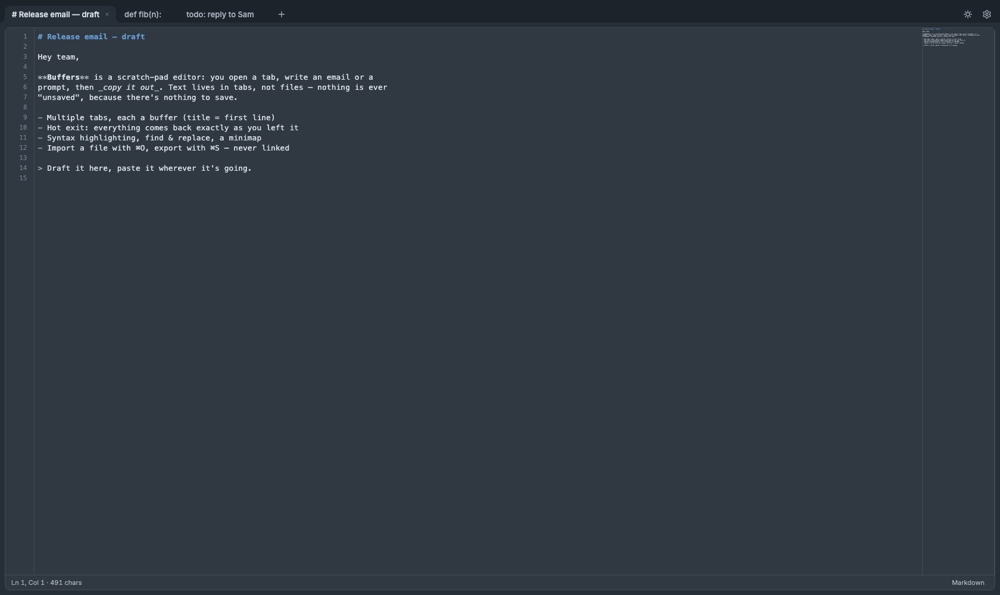

# Buffers

A minimalist, **Sublime-style scratch-buffer editor**. For the moments you open
a new tab just to write — an email, a long Teams message, a prompt for Claude or
ChatGPT — then copy it out to wherever it's going.

Buffers are the point: text that lives in tabs, not files. Nothing is ever
"unsaved," because there's nothing to save.



## Download

- [**macOS** (Apple silicon)](https://github.com/mtrencseni/buffers/releases/latest/download/Buffers-macos_arm64.dmg)
- [**Windows** (x64)](https://github.com/mtrencseni/buffers/releases/latest/download/Buffers-win_x64-portable.exe)

## Features

**The buffer model**
- **Tabs are buffers.** Each tab holds a chunk of text; the tab title is its
  first line. Open as many as you like.
- **Hot exit.** Everything auto-saves and comes back exactly as you left it —
  cursor, scroll, language and all. No save dialogs, ever. Closed one by
  accident? **⌘⇧T** brings it back, even across restarts.
- **Import / export, not open / save.** **⌘O** copies a file's contents into a
  *new* buffer and forgets the file; **⌘S** writes a buffer out once. Files and
  buffers are never linked.

**Editing**
- **Syntax highlighting for 50 languages**, auto-detected on import and
  switchable from the status bar — the picker is sorted and keyboard-driven
  (type `py` to jump to Python).
- Line numbers, **find & replace** (**⌘F** / **⌘⌥F**), a **minimap** with a
  Sublime-style overlay scrollbar that floats over it and auto-hides, soft line
  wrap (**⌥Z**), optional active-line highlight, adjustable text size.
- Sublime's selection rendering, including whitespace marks inside the
  selection.

**Remote** — optional, and off until you point it at a server
- **Your other machines' buffers, readable from this one.** Each machine
  publishes its own open buffers under its own hostname; the Remote tab
  (**⌘⇧R**) shows all of them. Strictly one-way and read-only — nothing syncs,
  merges, or writes back.
- **Cloud** is the curated half: **⌘⇧C** pushes the active buffer there on
  purpose, by name, and it stays until you delete it. Machine mirrors come and
  go with whatever's open; Cloud doesn't.
- **Works offline.** The last fetch is kept on disk, so the tab still opens on a
  plane — with the toolbar saying how old what you're looking at is.
- The server is a small Flask app in [`server/`](server) — self-hosted,
  token-authenticated, entirely optional. Buffers works exactly as before
  without one.

**Making it yours**
- Tabs across the **top** or down a **resizable left sidebar** — either way,
  drag to reorder.
- Light / dark (Sublime **Mariana**) themes, **fully configurable shortcuts**,
  and **⌘K** to see the current bindings on a drawn keyboard.
- Remembers its window size; opens at 80% of the screen the first time.

## Keyboard shortcuts

All rebindable in **Settings → Keyboard → Configure shortcuts**, and **⌘K**
shows them on a drawn keyboard. Defaults below are macOS; **on Windows every ⌘
is Ctrl** (⌘T → Ctrl+T, ⌥ → Alt):

| Keys | Action |
| --- | --- |
| ⌘T / ⌘N | New buffer |
| ⌘W | Close buffer _(Windows also Ctrl+F4)_ |
| ⌘⇧T | Reopen closed buffer |
| ⌘⇧[ · ⌘⇧] · ⌃⇥ · ⌘` | Switch / cycle buffers |
| ⌘1…⌘8 · ⌘9 | Jump to buffer 1–8 · last buffer |
| ⌘O | Import a file into a new buffer |
| ⌘S | Export the buffer to a file |
| ⌘⇧R | Remote — other machines' buffers |
| ⌘⇧C | Push this buffer to Cloud |
| ⌘F / ⌘⌥F | Find / find & replace |
| ⌥Z | Toggle line wrap |
| ⌘+ ⌘− ⌘0 | Bigger / smaller / reset text size |
| ⌘K | Keyboard map |
| ⌘, | Settings |
| ⌥⌘I | Developer tools (when enabled) |

## Development

The downloads above are the built app; this section is for working on it.
Requires [Node](https://nodejs.org) + [pnpm](https://pnpm.io) and the
[Rust toolchain](https://www.rust-lang.org/tools/install).

```sh
pnpm install
pnpm tauri dev      # the native app, with hot-reload
pnpm dev            # browser-only UI (buffers persist to localStorage)
pnpm tauri build    # a distributable app bundle
./node_modules/.bin/tsc            # typecheck
cd src-tauri && cargo check
```

On Windows you also need the
[MSVC C++ build tools](https://visualstudio.microsoft.com/visual-cpp-build-tools/)
(for the Rust linker) and the WebView2 runtime (preinstalled on Windows 11).

Buffers' editor is also the code preview in its sibling
[Delight](https://github.com/mtrencseni/delight), which re-exports
`src/editor-core.ts` and `src/langs.ts` from a side-by-side checkout — so those
two files must stay dependency-closed (CodeMirror and their own CSS only).

Releases are cut by pushing a `v*` tag: CI builds and publishes the Windows
binary, and the macOS build is attached from a Mac. See [CLAUDE.md](CLAUDE.md).

## Tech

Tauri 2 (Rust backend + WKWebView on macOS / WebView2 on Windows) with a vanilla
TypeScript / Vite frontend and [CodeMirror 6](https://codemirror.net) as the
editor. The frontend is the whole app; the Rust side is small — persistence,
file IO, and the HTTP the webview's CSP won't let it do itself.

- [PRODUCT.md](PRODUCT.md) — what the product is, how the buffer model works,
  and what it deliberately isn't (including where your data lives).
- [ARCHITECTURE.md](ARCHITECTURE.md) — how it's put together and why.
- [CLAUDE.md](CLAUDE.md) — working notes: per-platform status, where each OS
  difference lives, and the release checklist.
